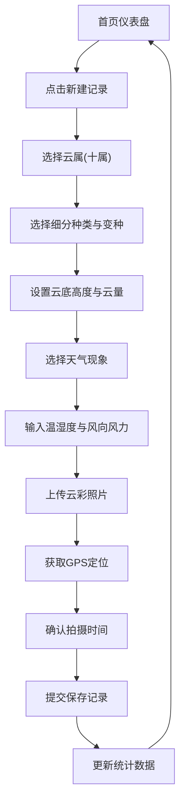
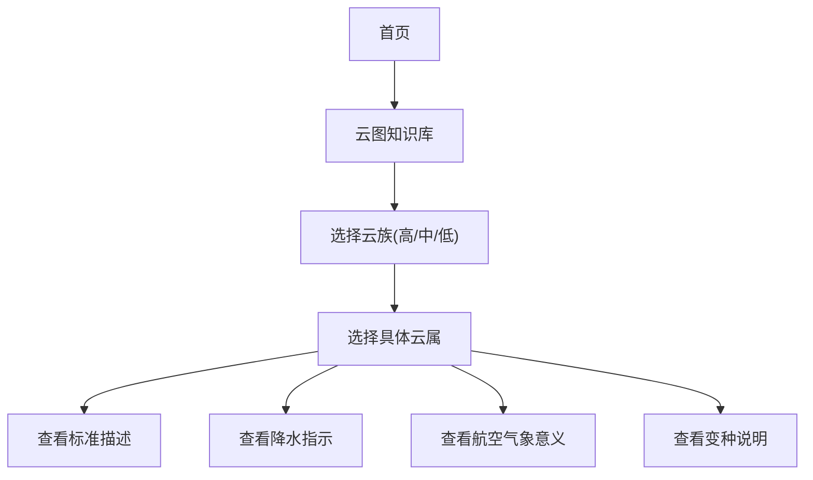

## 1. 产品概述

国际云图分类观察与气象记录助手是一款面向业余气象爱好者的系统化云彩观察记录工具。用户可依据世界气象组织(WMO)国际云图分类体系，对云彩形态进行专业分类、拍照记录、数据统计，并构建个人云图收藏。

- 核心价值：让业余爱好者也能以专业标准记录云彩，建立个人气象观察档案
- 目标用户：气象爱好者、摄影爱好者、自然观察者、学生与教育工作者
- 市场定位：专业级云图分类工具 + 个人气象记录日记本 + 云图知识百科

## 2. 核心功能

### 2.1 用户角色

| 角色 | 注册方式 | 核心权限 |
|------|---------|---------|
| 普通用户 | 本地存储(无需注册) | 所有功能：创建记录、浏览知识库、统计分析、地图展示 |

### 2.2 功能模块

1. **首页仪表盘**：统计概览卡片、云属覆盖度进度、最近记录时间线、月度分布图表
2. **新建记录**：云属选择器(十属)、细分种类与变种、云底高度、云量占比、天气现象、温湿度、风向风力、照片上传、GPS定位、拍摄时间
3. **历史记录**：记录列表卡片、按日期/云属/天气条件筛选、详情查看、编辑删除
4. **云图知识库**：十属云分类浏览、标准描述、示意图、降水指示、航空气象意义、变种说明
5. **地图展示**：拍摄点位地图分布、色标区分云属、点位详情弹窗

### 2.3 页面详情

| 页面名称 | 模块名称 | 功能描述 |
|---------|---------|----------|
| 首页仪表盘 | 统计概览卡片 | 总记录数、已观测云属数、本月记录数、连续观察天数 |
| 首页仪表盘 | 云属覆盖度进度 | 十属云收集进度环形进度条、百分比展示 |
| 首页仪表盘 | 月度分布图表 | 12个月记录数量柱状图、按云属配色堆叠 |
| 首页仪表盘 | 最近记录时间线 | 最新5条记录的卡片式时间线展示 |
| 新建记录 | 云属选择器 | 十属云图标+名称网格选择器，支持单选高亮 |
| 新建记录 | 细分种类变种 | 根据所选云属动态展示对应的种类与变种下拉选项 |
| 新建记录 | 气象参数表单 | 云底高度滑块、云量占比进度条、天气现象标签、温湿度输入、风向风力选择 |
| 新建记录 | 照片与位置 | 照片上传预览、GPS获取/手动输入、时间选择器 |
| 历史记录 | 筛选面板 | 日期范围、云属多选、天气条件多选筛选器 |
| 历史记录 | 记录卡片 | 缩略图+云属标签+核心气象信息的卡片网格 |
| 历史记录 | 详情模态框 | 完整记录信息+大图预览+编辑删除操作 |
| 云图知识库 | 分类导航 | 十属云顶部Tab导航，按高/中/低云族分组 |
| 云图知识库 | 详情卡片 | 云属标准描述、示意图(emoji/SVG)、降水指示、航空气象意义、变种列表 |
| 地图展示 | 交互式地图 | SVG世界地图背景、拍摄点位色标标记、云属图例 |
| 地图展示 | 点位交互 | 悬停显示信息气泡、点击跳转记录详情 |

## 3. 核心流程

### 主用户流程：创建观云记录

用户打开应用 → 在仪表盘点击"新建记录" → 选择云属(十属之一) → 选择细分种类与变种 → 设置云底高度与云量 → 选择天气现象 → 输入温湿度与风向风力 → 上传云彩照片 → 自动/手动获取GPS位置 → 确认拍摄时间 → 提交保存 → 返回仪表盘查看更新统计

### 知识浏览流程

## 4. 用户界面设计

### 4.1 设计风格

- **主色调**：天空蓝渐变 (#3B82F6 → #93C5FD) + 云白 (#F8FAFC) + 深靛蓝 (#1E3A5F)
- **辅助色**：日落橙 (#F97316) 用于重要操作、云属色标彩虹色系
- **按钮风格**：圆角胶囊按钮 (rounded-full)、主按钮渐变填充、次按钮描边+悬停填充
- **字体选择**：
  - 标题：Playfair Display (衬线，优雅气象杂志感)
  - 正文：Noto Sans SC (无衬线，中文可读性)
  - 数据/数字：JetBrains Mono (等宽，专业感)
- **布局风格**：毛玻璃卡片 (backdrop-blur) + 柔和阴影 + 圆角16px + 蓝天白云背景纹理
- **图标风格**：Lucide线条图标 + 气象专属emoji图标 (☁️ 🌤️ 🌧️)

### 4.2 页面设计概述

| 页面名称 | 模块名称 | UI元素 |
|---------|---------|--------|
| 首页仪表盘 | 顶部导航栏 | 毛玻璃背景、Logo云图标、导航Tab、新建记录按钮 |
| 首页仪表盘 | Hero区域 | 大渐变标题"今日观云"、日期、天气摘要、动态云飘动动画 |
| 首页仪表盘 | 统计卡片组 | 4张毛玻璃卡片、数字渐变突出、微悬浮动画 |
| 首页仪表盘 | 覆盖度进度 | 环形SVG进度条、十属网格缩略状态 |
| 首页仪表盘 | 月度图表 | 彩色堆叠柱状图、悬停tooltip、渐变背景 |
| 首页仪表盘 | 最近记录 | 垂直时间线、连接线动画、卡片缩略图 |
| 新建记录 | 表单页面 | 分段式进度指示、左侧导航步骤、右侧表单区 |
| 新建记录 | 云属选择 | 3×4图标网格、选中放大高亮、彩色边框 |
| 新建记录 | 照片区域 | 虚线上传框、预览网格、EXIF信息显示 |
| 历史记录 | 筛选栏 | 可折叠筛选面板、标签式选择器、实时过滤 |
| 历史记录 | 记录网格 | 瀑布流卡片、悬停上浮、云属彩色角标 |
| 云图知识库 | 页面布局 | 左侧固定导航、右侧滚动内容区 |
| 云图知识库 | 云属卡片 | 大尺寸emoji示意图、三栏信息布局、变种标签云 |
| 地图展示 | 地图容器 | SVG世界地图、彩色圆形点位、右侧图例面板 |

### 4.3 响应式设计

- **桌面优先** (1440px+)：多栏布局，充足留白
- **平板适配** (768-1439px)：双栏变单栏，卡片网格2列
- **手机适配** (<768px)：导航变底部Tab，卡片单列，全屏模态框
- **触控优化**：按钮最小48×48px，表单控件触控区域放大

