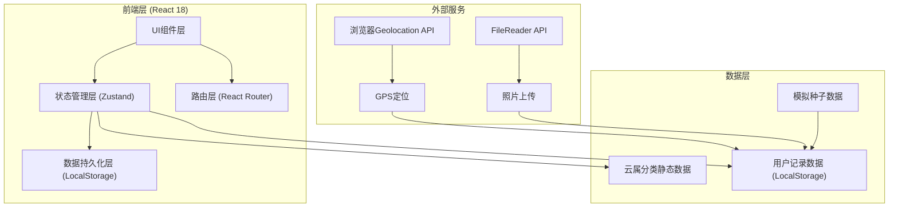
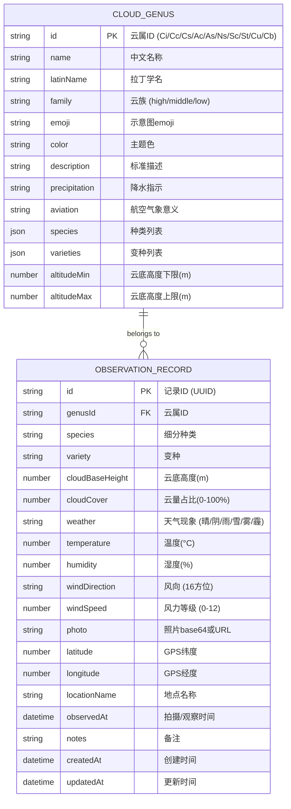

## 1. 架构设计



## 2. 技术描述

- **前端框架**：React@18 + TypeScript
- **构建工具**：Vite@5
- **样式方案**：TailwindCSS@3 + CSS Variables (主题系统)
- **状态管理**：Zustand@4 (含 persist 中间件做本地持久化)
- **路由方案**：React Router Dom@6
- **图标库**：Lucide React (线条图标)
- **图表方案**：Recharts (数据可视化图表)
- **地图方案**：SVG 内嵌世界地图 + 自定义标记图层
- **数据存储**：LocalStorage (Zustand persist)
- **图片处理**：FileReader API + Canvas 缩略图生成
- **定位服务**：浏览器 Geolocation API

## 3. 路由定义

| 路由 | 页面组件 | 用途 |
|------|---------|------|
| `/` | Dashboard | 首页仪表盘：统计概览、进度、图表、最近记录 |
| `/record/new` | NewRecord | 新建观云记录：表单填写、照片上传、GPS定位 |
| `/record/:id` | RecordDetail | 单条记录详情查看/编辑 |
| `/records` | RecordsList | 历史记录列表：筛选、卡片网格、详情 |
| `/knowledge` | KnowledgeBase | 云图知识库：十属分类浏览与详情 |
| `/map` | MapView | 地图展示：拍摄点位分布与色标标记 |

## 4. 数据模型

### 4.1 实体关系图



### 4.2 TypeScript 类型定义

```typescript
// 云族枚举
type CloudFamily = 'high' | 'middle' | 'low';

// 云属接口
interface CloudGenus {
  id: string;
  name: string;
  latinName: string;
  family: CloudFamily;
  emoji: string;
  color: string;
  description: string;
  precipitation: string;
  aviation: string;
  species: { id: string; name: string; description: string }[];
  varieties: { id: string; name: string; description: string }[];
  altitudeMin: number;
  altitudeMax: number;
}

// 天气现象枚举
type WeatherType = 'sunny' | 'cloudy' | 'rain' | 'snow' | 'fog' | 'haze';

// 风向枚举 (16方位)
type WindDirection = 'N' | 'NNE' | 'NE' | 'ENE' | 'E' | 'ESE' | 'SE' | 'SSE' |
                     'S' | 'SSW' | 'SW' | 'WSW' | 'W' | 'WNW' | 'NW' | 'NNW';

// 观察记录接口
interface ObservationRecord {
  id: string;
  genusId: string;
  species?: string;
  variety?: string;
  cloudBaseHeight: number;
  cloudCover: number;
  weather: WeatherType;
  temperature: number;
  humidity: number;
  windDirection: WindDirection;
  windSpeed: number;
  photo?: string;
  latitude?: number;
  longitude?: number;
  locationName?: string;
  observedAt: string;
  notes?: string;
  createdAt: string;
  updatedAt: string;
}

// 统计数据接口
interface Statistics {
  totalRecords: number;
  uniqueGenusCount: number;
  thisMonthRecords: number;
  streakDays: number;
  genusCoverage: { genusId: string; count: number; percentage: number }[];
  monthlyDistribution: { month: string; total: number; byGenus: Record<string, number> }[];
}

// Zustand Store 接口
interface CloudStore {
  records: ObservationRecord[];
  selectedGenus: CloudGenus | null;
  filters: { dateRange?: [Date, Date]; genera?: string[]; weather?: WeatherType[] };
  
  // Actions
  addRecord: (record: Omit<ObservationRecord, 'id' | 'createdAt' | 'updatedAt'>) => void;
  updateRecord: (id: string, updates: Partial<ObservationRecord>) => void;
  deleteRecord: (id: string) => void;
  setSelectedGenus: (genus: CloudGenus | null) => void;
  setFilters: (filters: Partial<CloudStore['filters']>) => void;
  getStatistics: () => Statistics;
  getFilteredRecords: () => ObservationRecord[];
}
```

### 4.3 初始种子数据

- 预置 WMO 十属云分类完整数据 (10 条 CloudGenus)
- 预置 15-20 条示例观察记录，覆盖所有十属云和不同月份
- 覆盖不同天气条件、地理位置、云量参数

## 5. 项目目录结构

```
src/
├── assets/
│   └── styles/
│       ├── globals.css       # 全局样式与主题变量
│       └── animations.css    # 动画关键帧定义
├── components/
│   ├── layout/
│   │   ├── Navbar.tsx        # 顶部导航栏
│   │   ├── Sidebar.tsx       # 侧边栏(知识库用)
│   │   └── PageContainer.tsx # 通用页面容器
│   ├── ui/
│   │   ├── Button.tsx        # 按钮组件
│   │   ├── Card.tsx          # 毛玻璃卡片
│   │   ├── ProgressRing.tsx  # 环形进度条
│   │   ├── CloudIcon.tsx     # 云图标组件
│   │   ├── Modal.tsx         # 模态框
│   │   └── Tag.tsx           # 标签组件
│   ├── dashboard/
│   │   ├── StatCard.tsx      # 统计卡片
│   │   ├── CoverageProgress.tsx # 覆盖度进度
│   │   ├── MonthlyChart.tsx  # 月度分布图表
│   │   └── RecentTimeline.tsx # 最近记录时间线
│   ├── record/
│   │   ├── GenusSelector.tsx # 云属选择器
│   │   ├── WeatherForm.tsx   # 气象参数表单
│   │   ├── PhotoUploader.tsx # 照片上传组件
│   │   ├── LocationPicker.tsx # GPS位置选择
│   │   ├── RecordCard.tsx    # 记录卡片
│   │   └── FilterPanel.tsx   # 筛选面板
│   ├── knowledge/
│   │   ├── GenusTab.tsx      # 云属分类Tab
│   │   └── GenusDetailCard.tsx # 云属详情卡片
│   └── map/
│       ├── WorldMap.tsx      # SVG世界地图
│       ├── MapMarker.tsx     # 地图标记点
│       └── MapLegend.tsx     # 地图图例
├── data/
│   ├── cloudGenera.ts        # 十属云静态数据
│   ├── seedRecords.ts        # 种子示例数据
│   └── constants.ts          # 常量(风向、天气等枚举)
├── hooks/
│   ├── useStatistics.ts      # 统计计算hook
│   ├── useGeolocation.ts     # GPS定位hook
│   └── useCloudFilters.ts    # 筛选逻辑hook
├── pages/
│   ├── Dashboard.tsx         # 首页仪表盘
│   ├── NewRecord.tsx         # 新建记录页
│   ├── RecordsList.tsx       # 历史记录列表
│   ├── KnowledgeBase.tsx     # 云图知识库
│   └── MapView.tsx           # 地图视图
├── store/
│   └── useCloudStore.ts      # Zustand全局状态
├── types/
│   └── index.ts              # 全局TypeScript类型
├── utils/
│   ├── dateUtils.ts          # 日期工具函数
│   ├── geoUtils.ts           # 地理工具函数
│   ├── imageUtils.ts         # 图片处理工具
│   └── weatherUtils.ts       # 气象数据工具
├── App.tsx                   # 根组件(路由)
└── main.tsx                  # 入口文件
```

